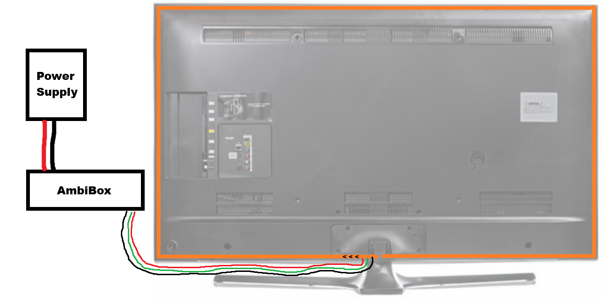
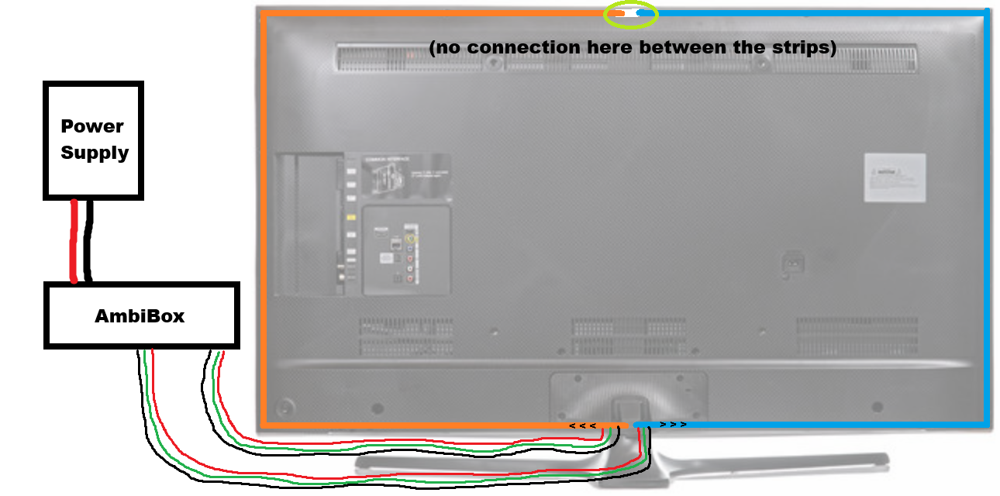

# AmbiBox

-a simple, affordable, and lag-free DIY TV-Backlight system with dual-segment support using [HyperHDR](https://github.com/awawa-dev/HyperHDR)

> The complete build guide, electronic wiring, and software setup configurations are available in the full guide: **[AmbiBox_Instructions.pdf](AmbiBox_Instructions.pdf)**.

This project solves the common issue of messy wiring by completely hiding the components (Raspberry Pi, ESP32, Capture Card) and cables inside a single, sleek 3D-printed housing. 

---

## Preview

### Assembled AmbiBox:

### The inside:

### Ambilight in Action
|                    Example 1                    |                   Example 2                    |                   Example 3                    |
|:-----------------------------------------------:|:-----------------------------------------------:|:-----------------------------------------------:|
|  |  |  |

---

## Key Features

- **Low Latency:** HyperHDR running on a Pi Zero 2 W connects to an ESP32 via HyperSPI (which also is from the developer of HyperHDR) for low-latency backlight reaction.
- **Dual-Segment Support:** Can power and control two separate LED strips to prevent voltage drop and overheating on long strips on larger TVs.
- **Clean All-in-One Case:** Fits the Pi, ESP32 and the Capture Card inside a single housing.
- **Power Button & Status LED:** Built-in slots for a physical button (safe software boot/shutdown) and an indicator LED.
---

## Main Hardware Components you wil need

- **Raspberry Pi Zero 2 W** (Running HyperHDR)
- **ESP32 Development Board** (Acts as the dedicated fast LED controller)
- **USB Video Capture Card**
- **RGB Strip(s)**
- **5V Power Supply** (Amperage depending on your TV size / LED count)

-> More component and wiring details are provided in the AmbiBox_Instructions.pdf file

---

## How a final setup looks like
The final setup consists of three main components: the power supply, the AmbiBox itself, and the RGB strip(s) mounted on the back of your TV. The power supply connects directly to the AmbiBox. From there, the AmbiBox distributes both power and the data signal to your one or two RGB strip segments.

|                Single Segment Setup                |                Dual Segment Setup                |
|:--------------------------------------------------:|:------------------------------------------------:|
|  |  |

---

## 3D Printing the Enclosure

You can find the STL files on my [Printables](https://www.printables.com/model/1737717-ambibox)

---

## License

This project is licensed under the **Creative Commons Attribution-NonCommercial-ShareAlike 4.0 International (CC BY-NC-SA 4.0)** License. You are free to print, tweak, and share your remixes, but commercial sale of the enclosure or system is strictly prohibited.