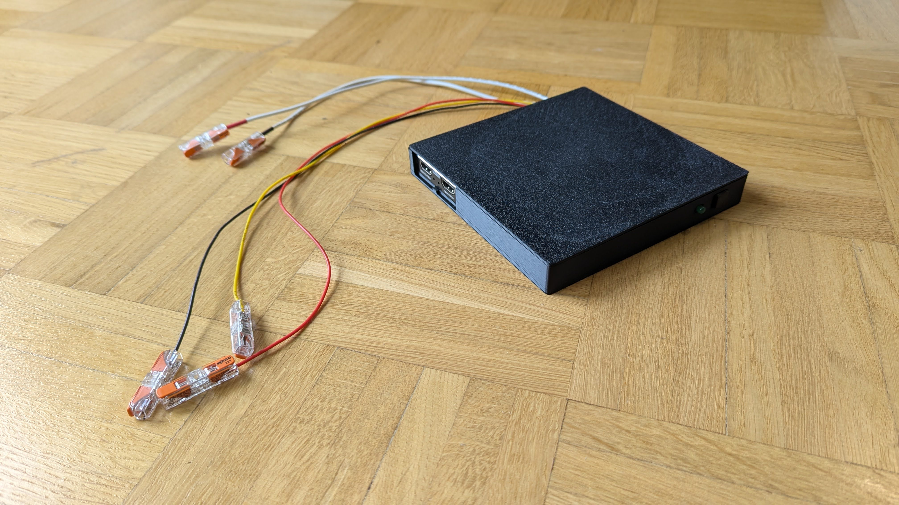
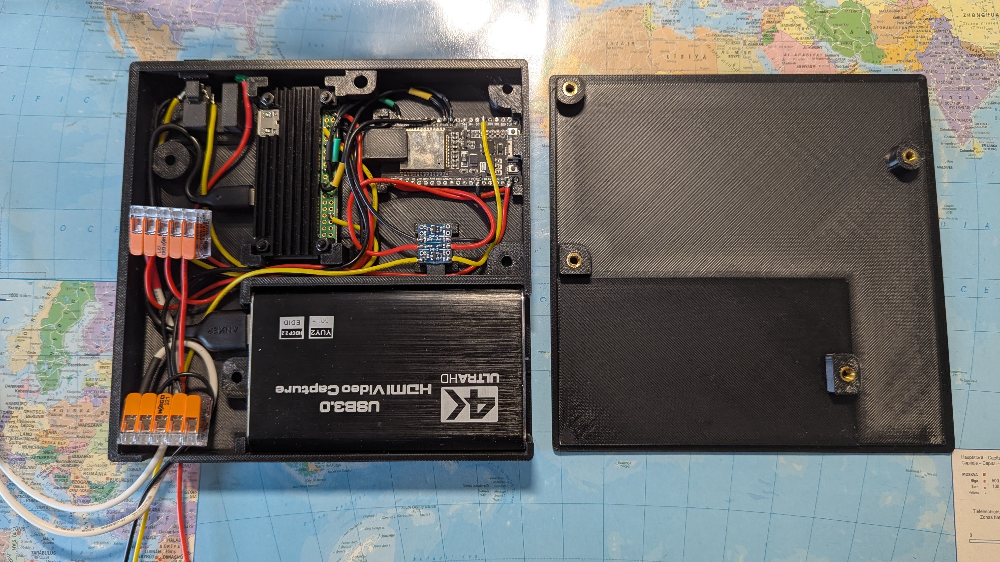
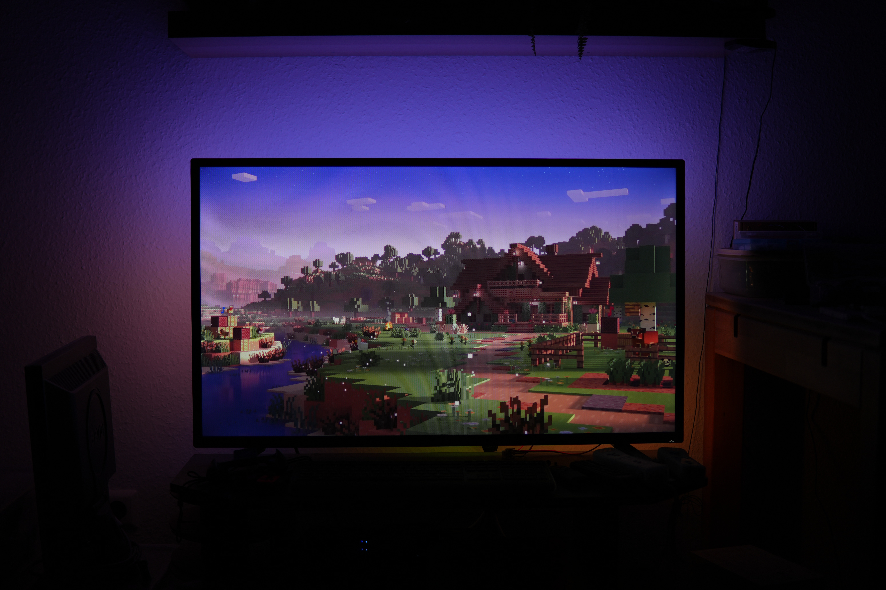
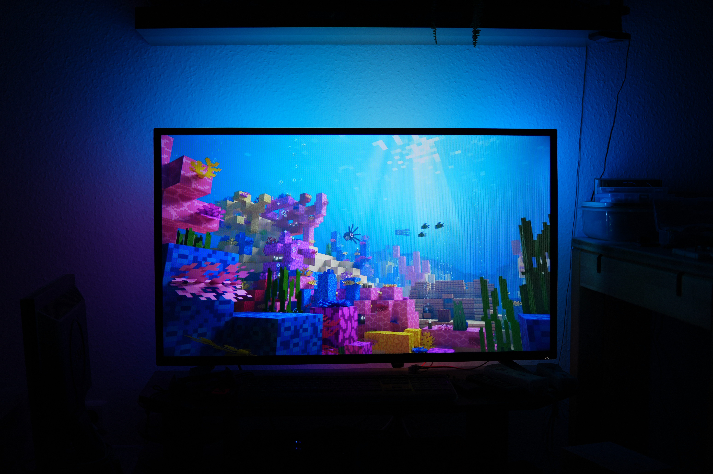
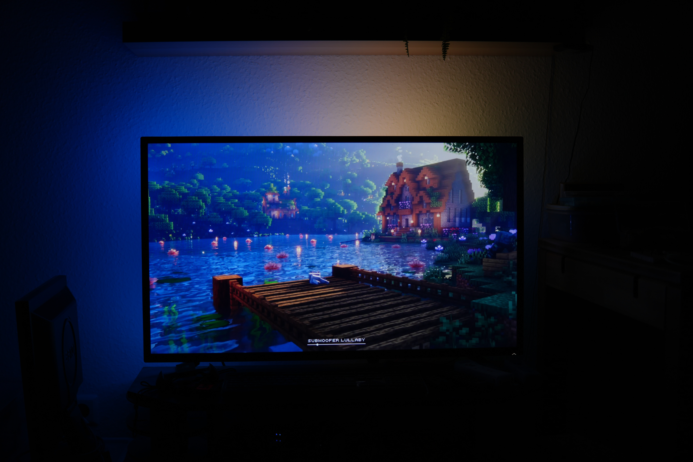

# AmbiBox

-a simple, affordable, and lag-free DIY TV-Backlight system with dual-segment support using [HyperHDR](https://github.com/awawa-dev/HyperHDR)

> The complete build guide, electronic wiring, and software setup configurations are available in the full guide: **[AmbiBox_Instructions.pdf](AmbiBox_Instructions.pdf)**.

This project solves the common issue of messy wiring by completely hiding the components (Raspberry Pi, ESP32, Capture Card) and cables inside a single, sleek 3D-printed housing. 

---

## Preview

### Assembled AmbiBox:

### The inside:

### Ambilight in Action
|                    Example 1                    |                   Example 2                    |                   Example 3                    |
|:-----------------------------------------------:|:-----------------------------------------------:|:-----------------------------------------------:|
|  |  |  |

---

## Key Features

- **Zero Latency Experience:** Powered by **HyperHDR** paired with an **ESP32** and a **Raspberry Pi Zero 2 W** via the high-speed **HyperSPI** interface.
- **Dual-Segment Support:** Safely power and control two separate LED strip lines. Essential for larger TVs to reduce overheating risks and maintain consistent voltage drop.
- **Clean Hardware Integration:** Fits a Pi Zero 2 W, ESP32, Logic Level Converter (LLC), WAGO connectors, and an HDMI-to-USB Video Capture Card completely inside the custom case.
- **Smart Power/Status System:** Includes mounting for a physical button (for software-safe boot/shutdown) and a status LED to indicate boot sequences and power states.

---

## Main Hardware Components

- **Raspberry Pi Zero 2 W** (Running HyperHDR)
- **ESP32 Development Board** (Acts as the dedicated fast LED controller)
- **USB Video Capture Card**
- **RGB Strip(s)**
- **5V Power Supply** (Amperage depending on your TV size / LED count)

-> More component and wiring details are provided in the AmbiBox_Instructions.pdf file

---

## 3D Printing the Enclosure

You can find the STL files on my [Printables](https://www.printables.com/model/1737717-ambibox)

---

## License

This project is licensed under the **Creative Commons Attribution-NonCommercial-ShareAlike 4.0 International (CC BY-NC-SA 4.0)** License. You are free to print, tweak, and share your remixes, but commercial sale of the enclosure or system is strictly prohibited.